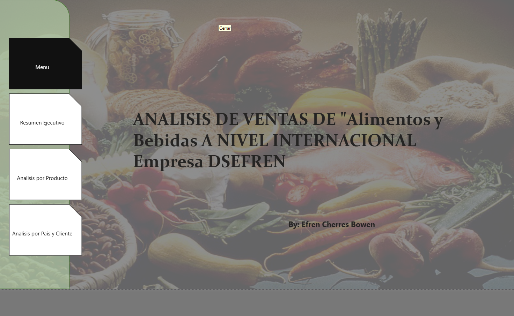
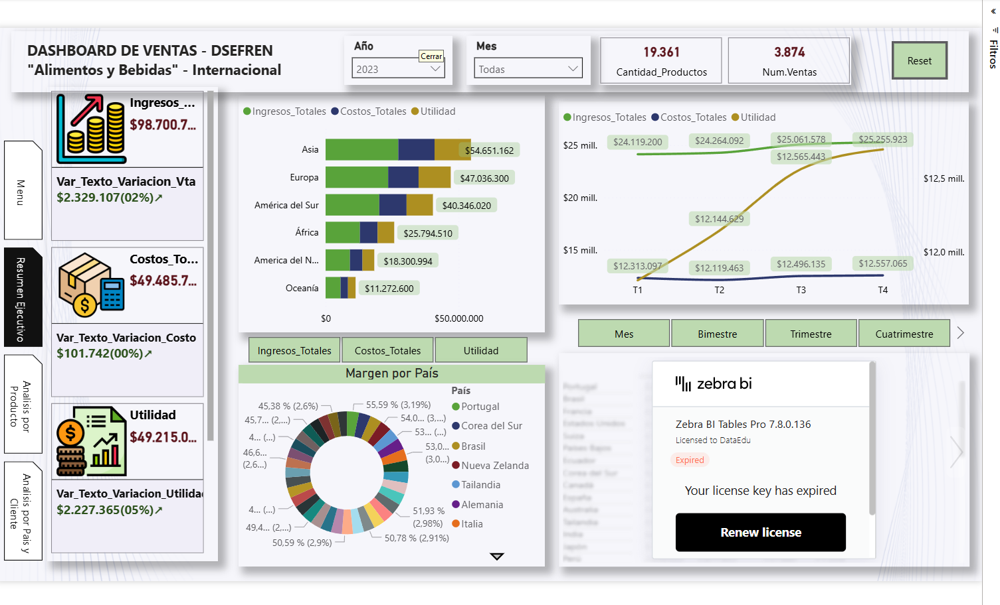
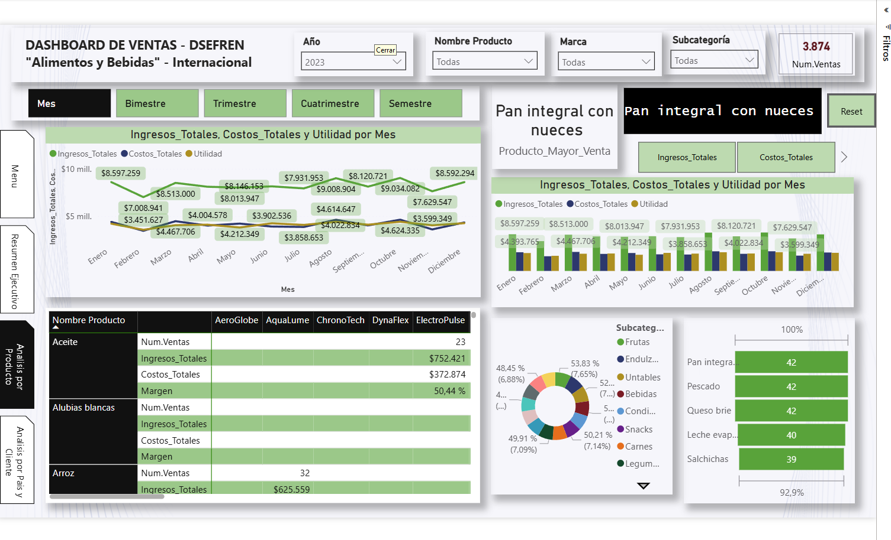
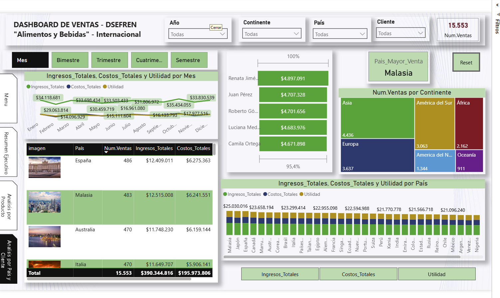

# 📊 Análisis de Ventas Internacionales - DSEFREN
> **Business Intelligence Solution for Food & Beverages Global Markets**

## 👤 Autor
**Efren Cherres Bowen** *Especialista en Análisis de Datos y Business Intelligence*

---

## 📝 Descripción del Proyecto
Este proyecto presenta una solución integral de visualización de datos para la empresa **DSEFREN**, enfocada en el sector de Alimentos y Bebidas. El dashboard permite una exploración multinivel (Ejecutiva, Producto y Geográfica) para identificar desviaciones de costos, maximizar utilidades y detectar oportunidades de mercado en los cinco continentes.

---

## 🖼️ Arquitectura del Dashboard (Desglose de Vistas)

### 1. Resumen Ejecutivo (Vista Gerencial)
Esta vista está diseñada para la alta dirección, enfocándose en indicadores de alto impacto y variaciones interanuales.

- **KPIs Dinámicos:** Seguimiento de Ingresos ($98.7M), Costos ($49.5M) y Utilidad ($49.2M) con sus respectivas variaciones porcentuales.
- **Análisis de Tendencias:** Gráficos de áreas comparativos que muestran el comportamiento financiero trimestral (T1-T4).
- **Participación de Mercado:** Desglose del margen por país mediante visualizaciones radiales.

### 2. Análisis por Producto (Eficiencia Operativa)
Se enfoca en el rendimiento del catálogo de productos y la rentabilidad por marca.

- **Ranking de Ventas:** Identificación del producto estrella (ej. *Pan integral con nueces* con $1.3M en ventas).
- **Matriz de Rentabilidad:** Tabla detallada con micro-gráficos integrados para comparar Ingresos vs. Costos por categoría (Aceites, Legumbres, Snacks, etc.).
- **Desglose de Subcategorías:** Análisis de Pareto para identificar las familias de productos más relevantes.

### 3. Análisis por País y Cliente (Inteligencia Comercial)
Orientado a la expansión global y comportamiento del consumidor.

- **Segmentación Geográfica:** Mapa de calor y treemap por continentes, destacando a **Asia** como el mercado con mayor número de ventas (4,436).
- **Top Clientes:** Ranking de clientes principales (Renata Jiménez, Juan Pérez, etc.) con volumen de facturación individual.
- **Análisis Comparativo Nacional:** Gráfica de barras de ingresos totales por país, identificando a **Malasia** como el país de mayor venta.

---

## 🛠️ Stack Tecnológico
- **Power BI Desktop:** Construcción de modelos de datos y reportes.
- **Zebra BI Tables & Charts:** Implementación de estándares IBCS (International Business Communication Standards) para reportes financieros accionables.
- **DAX (Data Analysis Expressions):** Creación de medidas complejas para cálculo de variaciones (Year-over-Year) y KPIs dinámicos.
- **ETL Process:** Limpieza y transformación de datos para asegurar la integridad de la información internacional.

---

## 🚀 Funcionalidades Destacadas
- **Navegación Intuitiva:** Menú lateral personalizado para cambiar de contexto sin perder el flujo de análisis.
- **Filtros Temporales Avanzados:** Capacidad de segmentación por Año, Mes, Bimestre, Trimestre, Cuatrimestre y Semestre.
- **Storytelling con Datos:** Uso de tooltips y jerarquías (drill-down) para profundizar desde la región hasta el cliente específico.

---

## 📂 Estructura del Repositorio
- `/Data`: Datasets originales (CSV/Excel).
- `/PBIX`: Archivo fuente del Dashboard de Power BI.
- `/Screenshots`: Capturas de pantalla de alta resolución de las tres vistas principales.

---

> "Los datos son el nuevo petróleo, pero el Business Intelligence es el motor que los transforma en valor."

---