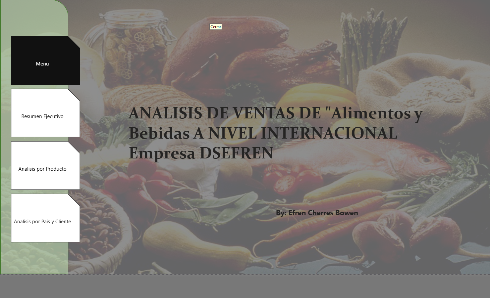

# Análisis de Ventas Internacionales - Empresa DSEFREN 📊🍎

Este proyecto presenta un análisis detallado del sector de **"Alimentos y Bebidas"** a nivel internacional para la empresa **DSEFREN**. El objetivo principal es transformar datos brutos en información estratégica para la toma de decisiones comerciales globales.

---

## 👤 Autor
**Efren Cherres Bowen**

---

## 📋 Tabla de Contenidos
- [Análisis de Ventas Internacionales - Empresa DSEFREN 📊🍎](#análisis-de-ventas-internacionales---empresa-dsefren-)
  - [👤 Autor](#-autor)
  - [📋 Tabla de Contenidos](#-tabla-de-contenidos)
  - [🚀 Resumen Ejecutivo](#-resumen-ejecutivo)
  - [🍎 Análisis por Producto](#-análisis-por-producto)
  - [🌎 Análisis por País y Cliente](#-análisis-por-país-y-cliente)
  - [🛠️ Tecnologías Utilizadas](#️-tecnologías-utilizadas)

---

## 🚀 Resumen Ejecutivo
En esta sección se consolidan los principales indicadores de rendimiento (**KPIs**) de la empresa.
- **Ventas Totales:** Visualización del crecimiento histórico.
- **Margen de Ganancia:** Análisis de rentabilidad por regiones.
- **Tendencias:** Identificación de patrones estacionales en el consumo de alimentos.

## 🍎 Análisis por Producto
Un desglose profundo del catálogo de la empresa:
- **Categorización:** Clasificación entre alimentos frescos, procesados y bebidas.
- **Top Sellers:** Identificación de los productos estrella que impulsan el volumen de ventas.
- **Stock vs. Demanda:** Análisis para la optimización de inventarios.

## 🌎 Análisis por País y Cliente
Enfoque en la expansión geográfica y fidelización:
- **Segmentación Geográfica:** Identificación de mercados líderes y mercados con potencial de crecimiento.
- **Perfil del Cliente:** Comportamiento de compra y segmentación según volumen de pedidos.
- **Logística:** Impacto de la distribución internacional en los costos finales.

---

## 🛠️ Tecnologías Utilizadas
Para el desarrollo de este dashboard/análisis se emplearon:
| Herramienta | Uso |
| :--- | :--- |
| **Power BI / Excel** | Procesamiento de datos y visualización |
| **SQL** | Extracción de base de datos de ventas |
| **Markdown** | Documentación del proyecto |

---

> **Nota:** Este proyecto es una herramienta estratégica diseñada para visualizar el impacto global de la empresa DSEFREN en el mercado de alimentos.